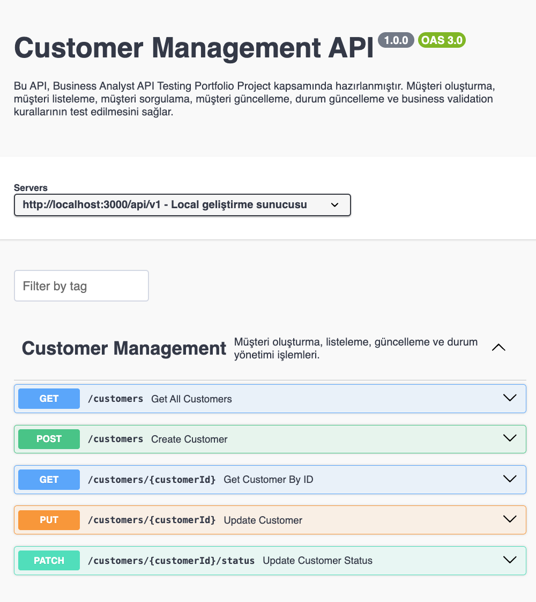
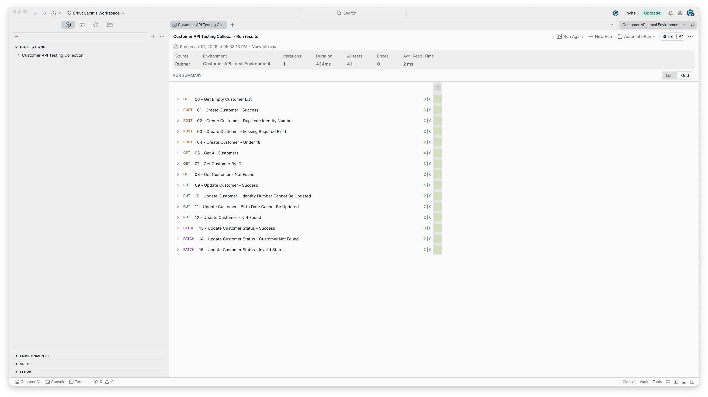

# Customer API Testing Project


Bu proje, bir İş Analistinin analiz, dokümantasyon ve API test süreçlerini uçtan uca göstermek amacıyla hazırlanmış kapsamlı bir portföy çalışmasıdır.

Proje kapsamında iş ihtiyacının analiz edilmesinden başlayarak paydaş görüşmeleri, iş gereksinimleri, business rule'lar, veri sözlüğü, REST API tasarımı, Swagger dokümantasyonu, test senaryoları, test case'ler, test verileri ve Postman ile API testleri hazırlanmıştır.

Mock API kullanmak yerine tamamen çalışan lokal bir REST API geliştirilmiş ve tüm business validation kuralları gerçek servis üzerinde doğrulanmıştır.

Bu proje backend geliştirme becerisini göstermek amacıyla değil; bir İş Analistinin gerçek bir projede yürüttüğü analiz, dokümantasyon ve API test süreçlerini göstermek amacıyla hazırlanmıştır.

---

# 📖 Bu Proje Nasıl İncelenmeli?

Bu repository gerçek bir İş Analisti çalışma akışına göre hazırlanmıştır.

Projeyi aşağıdaki sırayla incelemeniz önerilir.

| Sıra | Doküman | Açıklama |
|------|----------|----------|
| **1** | [`Business Request`](docs/Business-Request.md) | Projenin ortaya çıkış nedeni ve iş ihtiyacını inceleyin. |
| **2** | [`Stakeholder Interview`](docs/Stakeholder-Interview-01.md) | Paydaşlardan toplanan ihtiyaçları ve alınan kararları inceleyin. |
| **3** | [`Business Analysis Document`](docs/Business-Analysis-Document.md) | Gereksinimler, Business Rule'lar, Veri Sözlüğü, API Gereksinimleri, Validation Rule'lar ve Acceptance Criteria bölümlerini inceleyin. |
| **4** | [`Swagger API`](api/openapi.yaml) | REST API tasarımını inceleyin. Genel görünüm için [`Swagger Overview`](screenshots/swagger/01-Swagger-Overview.png) ekran görüntüsüne bakabilirsiniz. |
| **5** | [`Test Senaryoları`](testing/01-Test-Scenarios.md) | Fonksiyonel test senaryolarını inceleyin. |
| **6** | [`Test Case'ler`](testing/02-Test-Cases.md) | Test adımlarını ve beklenen sonuçları inceleyin. |
| **7** | [`Test Verileri`](testing/03-Test-Data.md) | Testlerde kullanılan request verilerini inceleyin. |
| **8** | [`Postman Collection`](testing/postman/Customer-API.postman_collection.json) | Hazırlanan API test koleksiyonunu inceleyin veya çalıştırın. |
| **9** | [`Screenshots`](screenshots/) | Swagger ve Postman test sonuçlarına ait ekran görüntülerini inceleyin. |

---

# 📑 İçindekiler

- [Proje Genel Bakış](#proje-genel-bakış)
- [Proje Kapsamı](#proje-kapsamı)
- [Repository Yapısı](#repository-yapısı)
- [İş Analizi Dokümanları](#ìş-analizi-dokümanları)
- [Swagger Dokümantasyonu](#swagger-dokümantasyonu)
- [API Endpointleri](#api-endpointleri)
- [Test Dokümanları](#test-dokümanları)
- [Postman API Testleri](#postman-api-testleri)
- [Projeyi Çalıştırma](#projeyi-çalıştırma)
- [Kullanılan Teknolojiler](#kullanılan-teknolojiler)
- [Ekran Görüntüleri](#ekran-görüntüleri)
- [Gelecekte Yapılabilecek Geliştirmeler](#gelecekte-yapılabilecek-geliştirmeler)
- [Geliştirici](#geliştirici)
---

# Proje Genel Bakış

Bu proje, bir İş Analistinin analiz ve API test süreçlerini gerçekçi bir senaryo üzerinden göstermek amacıyla hazırlanmıştır.

Senaryo kapsamında dijital bankacılık ortamında kullanılabilecek örnek bir **Customer Management API** ele alınmıştır. Proje boyunca iş ihtiyacının analiz edilmesinden başlayarak, gereksinimlerin belirlenmesi, business rule'ların oluşturulması, API tasarımı, test senaryolarının hazırlanması ve API testlerinin gerçekleştirilmesine kadar tüm süreç uçtan uca dokümante edilmiştir.

Proje içerisinde kullanılan REST API tamamen lokal olarak geliştirilmiş olup, tüm business validation kuralları gerçek servis üzerinde doğrulanmaktadır.

---

# Proje Kapsamı

Bu proje aşağıdaki İş Analizi ve API test süreçlerini kapsamaktadır.

| Çalışma | Durum |
|---------|:-----:|
| Business Request | ✅ |
| Stakeholder Interview | ✅ |
| Business Analysis Document | ✅ |
| Functional Requirements | ✅ |
| Non-Functional Requirements | ✅ |
| Business Rules | ✅ |
| Data Dictionary | ✅ |
| API Requirements | ✅ |
| Validation Rules | ✅ |
| Acceptance Criteria | ✅ |
| OpenAPI (Swagger) Documentation | ✅ |
| Local REST API | ✅ |
| Test Scenarios | ✅ |
| Test Cases | ✅ |
| Test Data | ✅ |
| Postman API Testing | ✅ |
| Newman Collection Runner | ✅ |
| Swagger UI | ✅ |

---

## Bu Projede Gerçekleştirilen API İşlemleri

| HTTP Method | Endpoint | Açıklama |
|-------------|----------|----------|
| POST | `/api/v1/customers` | Yeni müşteri oluşturur. |
| GET | `/api/v1/customers` | Tüm müşterileri listeler. |
| GET | `/api/v1/customers/{customerId}` | Belirli bir müşteriyi getirir. |
| PUT | `/api/v1/customers/{customerId}` | Müşteri bilgilerini günceller. |
| PATCH | `/api/v1/customers/{customerId}/status` | Müşteri durumunu günceller. |

---

## Uygulanan Business Rule Örnekleri

API üzerinde aşağıdaki business rule'lar gerçek olarak uygulanmış ve test edilmiştir.

- T.C. Kimlik Numarası benzersiz olmalıdır.
- Müşteri en az 18 yaşında olmalıdır.
- Telefon numarası 10 haneli olmalıdır.
- E-posta adresi girilmişse benzersiz olmalıdır.
- T.C. Kimlik Numarası güncellenemez.
- Doğum Tarihi güncellenemez.
- Status yalnızca **ACTIVE** veya **PASSIVE** olabilir.
- Müşteri fiziksel olarak silinmez, **PASSIVE** durumuna alınır.
---

# Repository Yapısı

Proje aşağıdaki klasör yapısına göre organize edilmiştir.

```text
customer-api-testing-project/
│
├── api/
│   ├── openapi.yaml
│   ├── package.json
│   └── src/
│
├── docs/
│   ├── Business-Request.md
│   ├── Stakeholder-Interview-01.md
│   ├── Stakeholder-Interview-02.md
│   ├── Stakeholder-Interview-03.md
│   └── Business-Analysis-Document.md
│
├── testing/
│   ├── 01-Test-Scenarios.md
│   ├── 02-Test-Cases.md
│   ├── 03-Test-Data.md
│   └── postman/
│
├── screenshots/
│   ├── swagger/
│   └── postman/
│
└── README.md
```

---

# İş Analizi Dokümanları

Bu proje boyunca hazırlanan tüm analiz dokümanları aşağıda listelenmiştir.

| Doküman | Açıklama |
|----------|----------|
| [`Business Request`](docs/Business-Request.md) | İş ihtiyacını ve projenin neden başlatıldığını açıklar. |
| [`Stakeholder Interview - 01`](docs/Stakeholder-Interview-01.md) | İş gereksinimlerinin paydaş görüşmeleriyle toplanmasını içerir. |
| [`Stakeholder Interview - 02`](docs/Stakeholder-Interview-02.md) | Veri alanları ve Data Dictionary kararlarını içerir. |
| [`Stakeholder Interview - 03`](docs/Stakeholder-Interview-03.md) | API tasarımı ve servis gereksinimlerini içerir. |
| [`Business Analysis Document`](docs/Business-Analysis-Document.md) | Functional Requirements, Business Rules, Data Dictionary, API Requirements, Validation Rules ve Acceptance Criteria dokümanlarını içerir. |

---

# Test Dokümanları

Analiz sonrasında hazırlanan test dokümanları aşağıda yer almaktadır.

| Doküman | Açıklama |
|----------|----------|
| [`Test Scenarios`](testing/01-Test-Scenarios.md) | Fonksiyonel test senaryolarını içerir. |
| [`Test Cases`](testing/02-Test-Cases.md) | Her senaryoya ait detaylı test adımlarını ve beklenen sonuçları içerir. |
| [`Test Data`](testing/03-Test-Data.md) | Test Case'lerde kullanılan Request Body örneklerini ve beklenen sonuçları içerir. |

---

# Dokümanlar Arasındaki İlişki

Bu projede hazırlanan dokümanlar birbirini takip edecek şekilde tasarlanmıştır.

```text
Business Request
        │
        ▼
Stakeholder Interview
        │
        ▼
Business Analysis Document
        │
        ▼
Test Scenarios
        │
        ▼
Test Cases
        │
        ▼
Test Data
        │
        ▼
Postman API Tests
```

Bu yapı sayesinde her test senaryosunun hangi iş gereksiniminden doğduğu ve hangi test verileri ile doğrulandığı kolayca takip edilebilir.
---

# Swagger Dokümantasyonu

Bu projede REST API dokümantasyonu **OpenAPI 3.0** standardı kullanılarak hazırlanmıştır.

Swagger dokümantasyonu sayesinde tüm endpoint'ler, request modelleri, response modelleri, HTTP durum kodları ve örnek istekler tek bir dosya üzerinden incelenebilir.

## Swagger Dosyası

- [`openapi.yaml`](api/openapi.yaml)

## Swagger Genel Görünümü

Swagger arayüzünün genel görünümü aşağıdaki ekran görüntüsünde yer almaktadır.



---

# API Endpointleri

Bu proje kapsamında geliştirilen Customer Management API aşağıdaki endpoint'lerden oluşmaktadır.

| HTTP Method | Endpoint | Açıklama |
|-------------|----------|----------|
| POST | `/api/v1/customers` | Yeni müşteri oluşturur. |
| GET | `/api/v1/customers` | Tüm müşterileri listeler. |
| GET | `/api/v1/customers/{customerId}` | Belirli bir müşteriyi getirir. |
| PUT | `/api/v1/customers/{customerId}` | Müşteri bilgilerini günceller. |
| PATCH | `/api/v1/customers/{customerId}/status` | Müşteriyi ACTIVE veya PASSIVE durumuna getirir. |

---

# API Özellikleri

API içerisinde aşağıdaki business validation kuralları uygulanmaktadır.

- ✅ Zorunlu alan kontrolü
- ✅ T.C. Kimlik Numarası format kontrolü
- ✅ T.C. Kimlik Numarası benzersizlik kontrolü
- ✅ En az 18 yaş kontrolü
- ✅ Telefon numarası format kontrolü
- ✅ E-posta format kontrolü
- ✅ E-posta benzersizlik kontrolü
- ✅ Güncellenemeyen alan kontrolü
- ✅ Bilinmeyen (Unknown) alan kontrolü
- ✅ ACTIVE / PASSIVE durum kontrolü
- ✅ Standart hata (ErrorResponse) yapısı
- ✅ HTTP Status Code doğrulamaları

---

# Postman API Testleri

Swagger dokümantasyonunda tanımlanan tüm endpoint'ler Postman kullanılarak test edilmiştir.

Hazırlanan Collection içerisinde;

- Pozitif senaryolar
- Negatif senaryolar
- Validation testleri
- Business Rule testleri
- Response doğrulamaları
- HTTP Status Code kontrolleri

yer almaktadır.

## Postman Collection

- [`Customer-API.postman_collection.json`](testing/postman/Customer-API.postman_collection.json)

## Collection Runner Sonucu

Aşağıdaki ekran görüntüsünde tüm testlerin başarıyla çalıştırıldığı Collection Runner sonucu yer almaktadır.



---

# Postman Test Ekran Görüntüleri

Her endpoint için hazırlanan örnek testler aşağıdaki klasörde yer almaktadır.

- [`screenshots/postman`](screenshots/postman)

Bu klasörde;

- Başarılı müşteri oluşturma
- Duplicate Identity Number
- Zorunlu alan kontrolü
- 18 yaş kontrolü
- Müşteri listeleme
- Müşteri detayı
- Müşteri güncelleme
- Status güncelleme
- Hata senaryoları

gibi örnek API testleri ekran görüntüleri ile birlikte sunulmuştur.
---

# Projeyi Çalıştırma

Projeyi kendi bilgisayarınızda çalıştırmak için aşağıdaki adımları takip edebilirsiniz.

## 1. Repository'yi Klonlayın

```bash
git clone https://github.com/<github-kullanici-adiniz>/customer-api-testing-project.git
```

## 2. API Klasörüne Geçin

```bash
cd customer-api-testing-project/api
```

## 3. Bağımlılıkları Kurun

```bash
npm install
```

## 4. API'yi Başlatın

```bash
npm start
```

API aşağıdaki adreste çalışacaktır.

```text
http://localhost:3000
```

Swagger dokümantasyonu için:

```text
api/openapi.yaml
```

dosyasını Swagger Editor gibi OpenAPI destekleyen araçlarda görüntüleyebilirsiniz.

---

# Kullanılan Teknolojiler

Bu proje kapsamında aşağıdaki teknolojiler kullanılmıştır.

| Teknoloji | Kullanım Amacı |
|------------|----------------|
| Node.js | REST API geliştirme |
| Express.js | API geliştirme çatısı |
| JavaScript | Backend geliştirme |
| OpenAPI 3.0 | API dokümantasyonu |
| Swagger | API dokümantasyonu ve tasarımı |
| Postman | API testleri |
| Newman | Collection Runner |
| Git | Versiyon kontrolü |
| GitHub | Kaynak kod yönetimi |
| Markdown | Dokümantasyon |

---

# Ekran Görüntüleri

Proje kapsamında hazırlanan ekran görüntüleri aşağıdaki klasörlerde yer almaktadır.

## Swagger

- [`Swagger Screenshots`](screenshots/swagger)

Swagger dokümantasyonunun genel görünümünü içermektedir.

## Postman

- [`Postman Screenshots`](screenshots/postman)

Postman Collection Runner sonucu ve endpoint bazlı API test ekran görüntülerini içermektedir.

---

# Gelecekte Yapılabilecek Geliştirmeler

Bu proje bir portföy çalışması olarak hazırlanmıştır. Gelecekte aşağıdaki geliştirmeler eklenebilir.

- JWT Authentication
- Authorization (Role Based Access Control)
- Docker desteği
- Veritabanı entegrasyonu (PostgreSQL / MongoDB)
- CI/CD Pipeline
- Loglama mekanizması
- Rate Limiting
- Pagination, Filtering ve Sorting desteği
- API Versioning
- Otomatik Test Raporları

---

# Geliştirici

**Erkut Laçın**

Bu proje, İş Analizi, REST API analizi, dokümantasyon ve API test süreçlerini göstermek amacıyla hazırlanmış bir portföy çalışmasıdır.

## İletişim

- GitHub: https://github.com/<github-kullanici-adiniz>
- LinkedIn: https://linkedin.com/in/<linkedin-kullanici-adiniz>
- Medium: https://medium.com/@<medium-kullanici-adiniz>

---

> Bu repository, bir İş Analistinin iş ihtiyacından başlayarak analiz, dokümantasyon, API tasarımı ve test süreçlerini uçtan uca nasıl yönettiğini göstermek amacıyla hazırlanmıştır.
---

## Teşekkür

Bu projeyi incelediğiniz için teşekkür ederim.

Görüş, öneri veya geri bildirimlerinizi paylaşabilirsiniz.

⭐ Eğer projeyi faydalı bulduysanız repository'yi yıldızlamayı düşünebilirsiniz.
